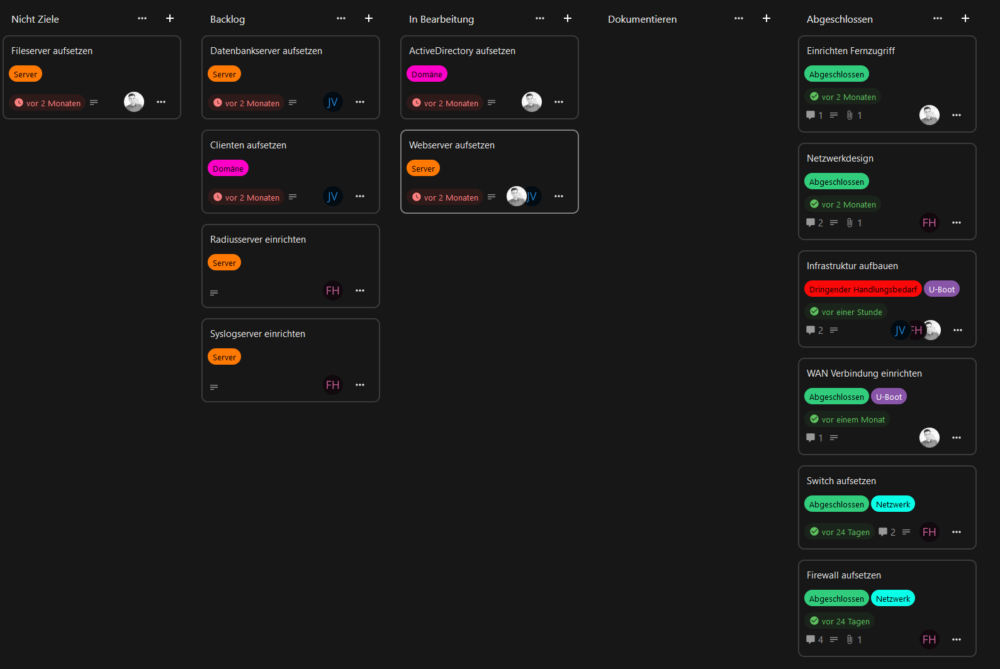

# JF Protokoll vom 15.12.2024

> Teilnehmer: Lukas Oschmann, Jannis Vavritsas

## Themen

1. Festlegung Abarbeitung offener Aufgaben
2. Festlegung Themen zum Abklären am Dienstag 17.12.2024
3. Organisatorische Punkte
4. Status des Kanban Boards

### 1. Festlegung Abarbeitung offener Aufgaben

- Datenbankserver, Webserver und ActiveDirectory müssen bis zum 17.12.2024 fertiggestellt werden
- Fileserver soll nicht mehr ausgearbeitet werden

### 2. Festlegung Themen zum Abklären am Dienstag 17.12.2024

- Netztrennung wie ausführlich
- Festlegung Anzahl der Server
- Festlegung welche Pentests durchgeführt werden sollen

### 3. Organisatorische Punkte

- Konfigurationsdateien weiterhin in GitHub
- Kanban Karten auch für Kleinigkeiten anlegen (Spiegelung der aktiven Tätigkeiten am Projekt)
- Tätigkeiten an Aufgaben in entsprechender Karte dokumentieren

### 4. Status des Kanban Boards
